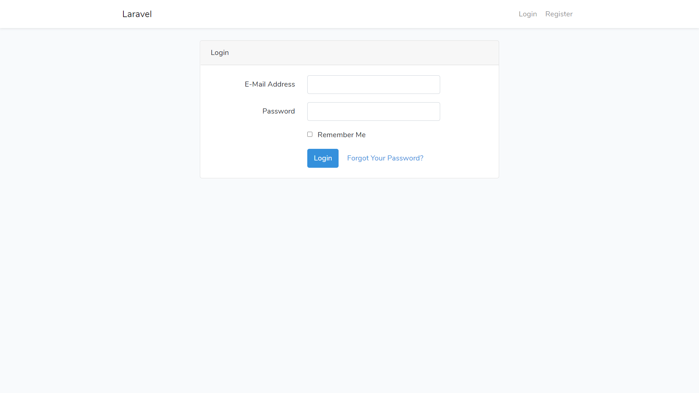

# Laravel Group Project - Stuck Overblow
This is a project to fulfill final project requirement at SanberCode Laravel training bootcamp.

## Descriptions
This website is an imitation of "Stack Overflow" website which is provides forum for people to post their questions.
Made with PHP in Laravel framework.

 In this project, you can register, login, and post your questions
 You can edit or delete the questions, and see all questions available or your question only.

 Please have a quick look with project's preview below. Thank you!

## Run Guide
You can run this project with Visual Studio 2015 or newer, and from View/Homepage.aspx file

## Project's Preview

 

 

 

 

## Technologies
▸ HTML 
▸ CSS 
▸ Javascript 
▸ PHP 
▸ Laravel 
▸ MVC Pattern 
▸ Visual Studio Code 
